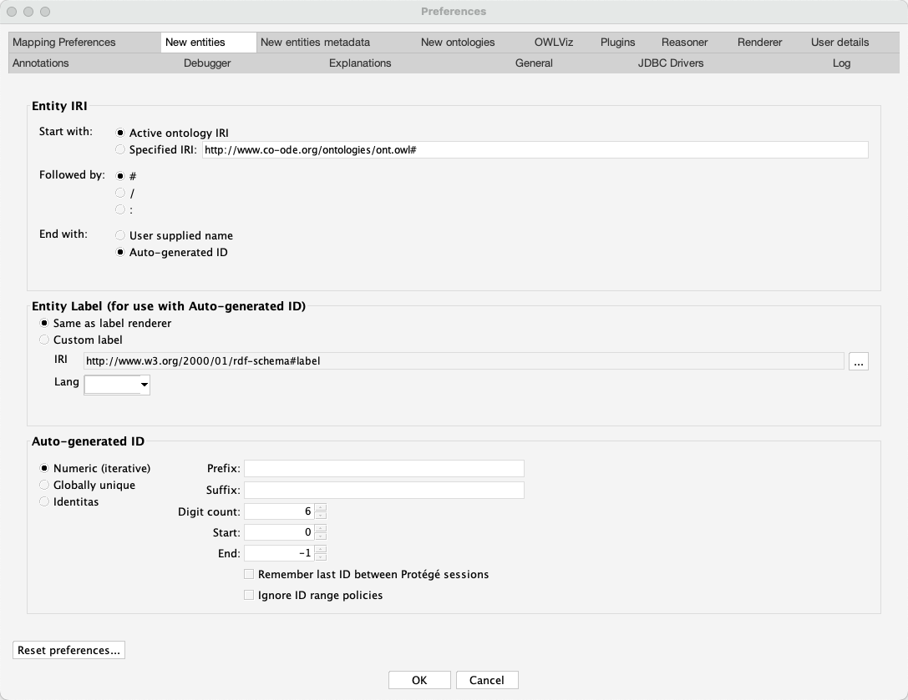

# molsim: Molecular Simulation Ontology

## Introduction

molsim is an interoperable domain ontology designed to semantically represent platform-agnostic molecular simulations as FAIR (Findable, Accessible, Interoperable, and Reusable) datasets. This ontology aims to standardize the representation of molecular simulation data, processes, and methodologies across different platforms and tools.

## Scope

The ontology covers various aspects of molecular simulations, including:

- Simulation processes (preparation, execution, analysis)
- Force fields and models
- Algorithms (thermostats, barostats, constraining algorithms)
- Materials and solvation models
- Interaction types and calculation methods

## Opening the Ontology

You can open and explore molsim using Protégé, a free, open-source ontology editor. Protégé is available in both desktop and web versions.

## Opening the Ontology

### IMPORTANT! 
To edit (adding new terms) in MOLSIM, please only do so in the `src/ontology/molsim-edit.owl` file. 
The rest should be taken care with ODK commands.

For importing new terms or adding components that are not covered by imports, plese refer to the custom import or adding components manual, respectively. 

### Desktop Version

1. Download and install Protégé desktop from: https://protege.stanford.edu/
2. Launch Protégé
3. Go to File > Open
4. Navigate to the location of the `src/ontology/molsim-edit.owl` file and open it
5. Go to Protégé > Settings, on the Preferences window, go to the "New entities" tab, and set the parameters to the following values:
   
     
   
   
   
   

### Web Version - not recommended

1. Visit WebProtégé: https://webprotege.stanford.edu/
2. Create an account or log in
3. Click on "Create Project" or "Upload Project"
4. Upload the `molsim-edit.owl` file

Note: WebProtégé does not support reasoner. Please use the desktop version instead to ensure proper logical checks.

## Contributing

We welcome contributions to improve and expand molsim. Please feel free to submit issues or pull requests to our repository.

## License

https://creativecommons.org/licenses/by-nc-sa/4.0/

## Contact

f.musyaffa (at) fz-juelich (dot) de
